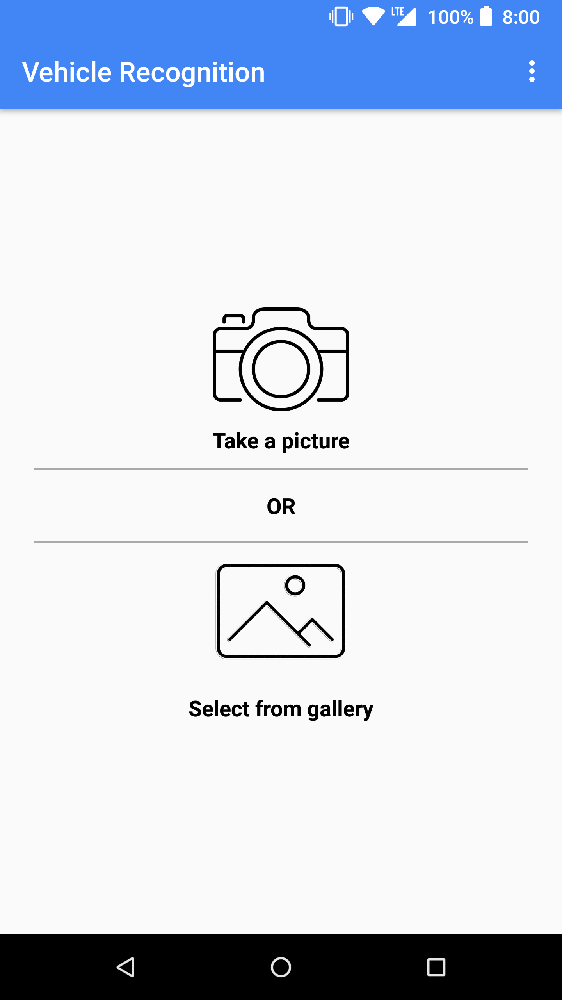
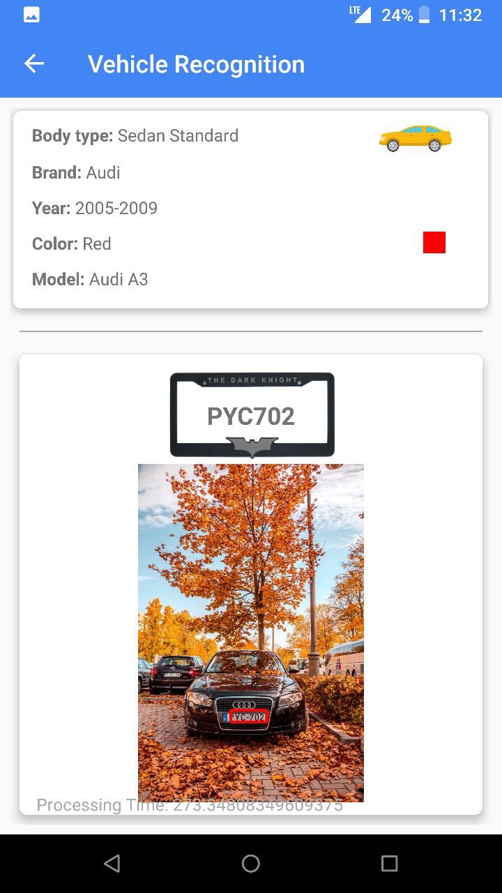
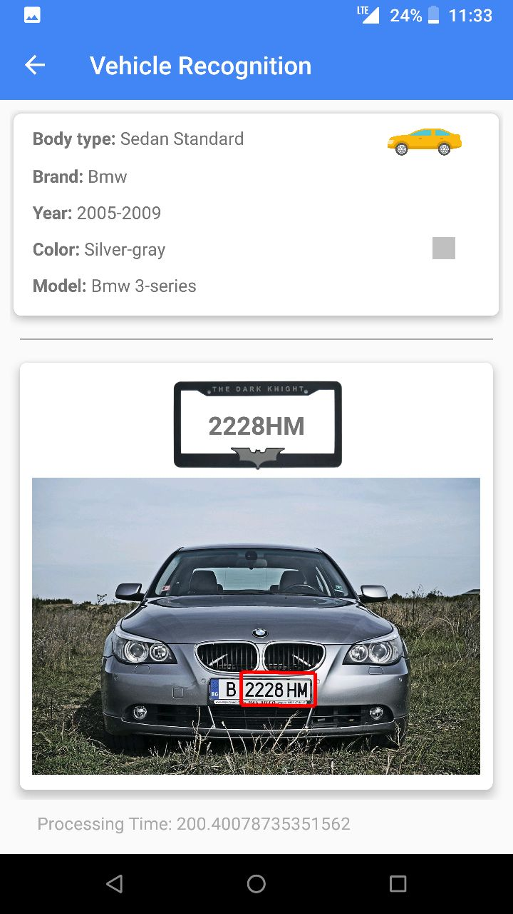

# CarRecognition

## Due to Price and Cost, I've deprecated the API. The project will return 404 result when GET/POST requests are made. 

This is one of the best vehicle recognition applications. It can determine the car's license plate number, color, model, brand and year.
      
            

       

